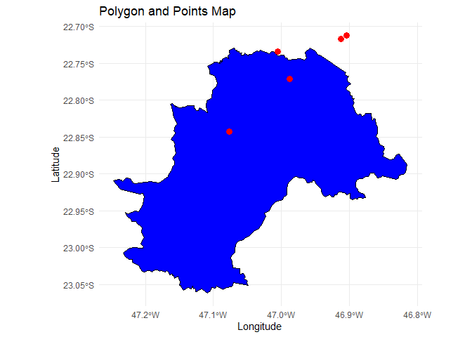

# RefineGeo

The goal of RefineGeo is to facilitate the comparison between geocoding
services coordinates. It uses the methodology from the
[study](https://feac.org.br/wp-content/uploads/2023/10/Geocodificacao_FEAC.pdf?portfolioCats=3100%2C3850%2C4090)
of the Geocoding process from the Single Registry (Cadastro Único) of
Campinas.

## Installation

You can install the development version of RefineGeo from
[GitHub](https://github.com/pedroTL) with:

``` r
# install.packages("devtools")
devtools::install_github("PedroTL/RefineGeo")
```

## Introduction

At present, the toolkit comprises five primary functions:

- `clean_address`: Cleanses address strings by removing punctuation,
  accents, double white spaces, and converting all characters to
  uppercase.
- `extr_cep`: Extracts the CEP (equivalent to Zip Code) from an address
  string, accommodating both 8 and 5-digit patterns.
- `compare_cep`: Verifies CEP matches between two strings.
- `points_out`: Identifies coordinates located outside a municipality’s
  polygon boundaries.
- `get_best_coords`:
  - Calculates kilometer-based distances between pairs of points from
    three Geocoding services.
  - Identifies the two services with the shortest distance points.
  - Extracts CEP patterns from addresses.
  - Compares CEP equality between the CEPs found in the input address
    and the three output addresses.
  - Computes the Method of Double Confirmation (MDC), enabling the
    ranking of each service. [MDC
    Reference](https://feac.org.br/wp-content/uploads/2023/10/Geocodificacao_FEAC.pdf?portfolioCats=3100%2C3850%2C4090),
    enabling to rank up each service.

## Basic Usage

Consider a scenario where you have an address string that contains
pronunciation variations, double white spaces, and other typical input
address issues.

``` r
library(RefineGeo)
library(ggplot2)
library(sf)
library(geobr)
```

``` r
# Sample address
address <- c("Rua JosÉ DôIS - -  12345678", "R. DR, JÔSÉ DÓIS  AV: 1 -- (12345)")
clean_address(address)
#> [1] "RUA JOSE DOIS 12345678"    "R DR JOSE DOIS AV 1 12345"
```

A noteworthy aspect when analyzing addresses and Geocoding is the CEP,
known in Brazil as the `Código de Endereçamento Postal`, equivalent to
the Zip Code. It encapsulates address information into a standardized
code.

The CEP consists of two parts. The first five digits represent:

- 1: Region
- 2: Sub-Region
- 3: Sector
- 4: Subsector
- 5: Subsector Divisor

The five-digit segment provides polygonal information, indicating a
larger area that encompasses the full eight-digit CEP.

The final three suffixes following the “-” symbol identify individual
streets, specific codes, and Correios units. For further details, refer
to the official Correios
[website](https://www.correios.com.br/enviar/precisa-de-ajuda/tudo-sobre-cep)

CEP serves as a useful tool for evaluating the quality metrics of
various Geocoding services. Each service offers a quality metric for the
Geocoded address and output coordinate. For example, the `ArcGIS`
service provides a score ranging from 0 to 100, while `Google` and
`Bing` categorize their metrics into `ROOFTOP`, `Low`, `Medium`, and
`High.`

When attempting to compare coordinates across different services,
working with individual metrics might pose challenges. In such
instances, CEP can establish a standardized method that remains
consistent across services.

**The fundamental premise here is: if the provided CEP in the input
address matches the CEP in the output address provided by the Geocoding
service, we can assume a high level of accuracy for that coordinate.**

For example, given two strings—one representing the input address and
the other the Geocoding service’s `output—extr_cep()` can be utilized to
isolate and extract the CEP patterns from these strings.

``` r
# Sample address
input_address <- c("RUA JOSE DOIS 12345678", "R DR JOSE DOIS AV 1 12345")
output_address <- c("RUA JOSE DOIS 12345678", "R DR JOSE DOIS AV 1 12345")

# Extracting CEP
extr_cep(input_address) # Input address CEP
#> [1] "12345678" NA
extr_cep(output_address, subsector_as_zip = TRUE)  # Output address CEP
#> [1] "12345678" "12345"
```

The `extr_cep()` function can explicitly consider 5-digit (subsector)
patterns as CEP if indicated by `subsector_as_zip = TRUE`. Otherwise, it
will return NA for 5-digit patterns and focus solely on locating 8-digit
CEPs.

Meanwhile, the `compare_cep()` function operates within a data frame
structure and generates a column with binary values (1 indicating a
match between two columns’ CEPs and 0 denoting no match).

``` r
# Sample data frame
df <- data.frame(cep1 = c("12345", "12345678", "12345", "12345", "12345"),
                 cep2 = c("12345", "12345678", "54321", "123", "12345"))

# Comparing CEPs
compare_cep(df, "cep1", "cep2")                      
#> [1] NA  1 NA NA NA
compare_cep(df, "cep1", "cep2", strict_check = TRUE)
#> [1]  1  1  0 NA  1
```

The `subsector_as_zip = TRUE` option functions effectively when used
alongside `strict_check = TRUE`. With this setup, if CEPs are extracted
in both 5 and 8 digits, the `compare_cep()` function enables
specification via `strict_check = TRUE` to include 5-digit CEPs in the
equality comparison.

Another valuable function is `points_out()`. Typically, when handling
Geocoded addresses, you might want to visualize and work with spatial
features. This function operates at the municipality level. Essentially,
`points_out()` determines whether a provided coordinate (point) from a
Geocoding service, for a given address, lies inside or outside a
municipality’s boundary (polygon).

For example, this function takes several latitude and longitude pairs
from the Campinas-SP municipality and verifies if they fall within or
outside the municipality’s boundary. The resulting column in the data
frame can be specified; here, I used `out_camp`. Using an out `prefix`
is considered a good practice for easy interpretation. If the value is
`TRUE`, the coordinate indeed lies outside the polygon.

Under the hood, the function utilizes `read_municipality()` from
`geobr`. Therefore, a municipality code, along with the year and a
`CRS projection`, must be provided.

``` r
# Sample data
df <- data.frame(lat = c(-22.71704, -22.71258, -22.84277, -22.73391, -22.77165),
                 lon = c(-46.91200, -46.90435, -47.07650, -47.00500, -46.98793))

# Getting the Campinas SHP.
shp_campinas <- read_municipality(code_muni = 3509502, year = 2020) %>%
    st_transform(4326)
#> Downloading: 780 B     Downloading: 780 B     Downloading: 8.7 kB     Downloading: 8.7 kB     Downloading: 8.7 kB     Downloading: 8.7 kB     Downloading: 8.7 kB     Downloading: 8.7 kB     Downloading: 17 kB     Downloading: 17 kB     Downloading: 41 kB     Downloading: 41 kB     Downloading: 41 kB     Downloading: 41 kB     Downloading: 49 kB     Downloading: 49 kB     Downloading: 49 kB     Downloading: 49 kB     Downloading: 73 kB     Downloading: 73 kB     Downloading: 82 kB     Downloading: 82 kB     Downloading: 110 kB     Downloading: 110 kB     Downloading: 110 kB     Downloading: 110 kB     Downloading: 130 kB     Downloading: 130 kB     Downloading: 150 kB     Downloading: 150 kB     Downloading: 150 kB     Downloading: 150 kB     Downloading: 150 kB     Downloading: 150 kB     Downloading: 170 kB     Downloading: 170 kB     Downloading: 180 kB     Downloading: 180 kB     Downloading: 180 kB     Downloading: 180 kB     Downloading: 190 kB     Downloading: 190 kB     Downloading: 200 kB     Downloading: 200 kB     Downloading: 220 kB     Downloading: 220 kB     Downloading: 220 kB     Downloading: 220 kB     Downloading: 220 kB     Downloading: 220 kB     Downloading: 250 kB     Downloading: 250 kB     Downloading: 430 kB     Downloading: 430 kB     Downloading: 460 kB     Downloading: 460 kB     Downloading: 460 kB     Downloading: 460 kB     Downloading: 470 kB     Downloading: 470 kB     Downloading: 500 kB     Downloading: 500 kB     Downloading: 500 kB     Downloading: 500 kB     Downloading: 500 kB     Downloading: 500 kB     Downloading: 510 kB     Downloading: 510 kB     Downloading: 530 kB     Downloading: 530 kB     Downloading: 530 kB     Downloading: 530 kB     Downloading: 540 kB     Downloading: 540 kB     Downloading: 560 kB     Downloading: 560 kB     Downloading: 570 kB     Downloading: 570 kB     Downloading: 570 kB     Downloading: 570 kB     Downloading: 570 kB     Downloading: 570 kB     Downloading: 590 kB     Downloading: 590 kB     Downloading: 610 kB     Downloading: 610 kB     Downloading: 610 kB     Downloading: 610 kB     Downloading: 620 kB     Downloading: 620 kB     Downloading: 640 kB     Downloading: 640 kB     Downloading: 640 kB     Downloading: 640 kB     Downloading: 650 kB     Downloading: 650 kB     Downloading: 670 kB     Downloading: 670 kB     Downloading: 670 kB     Downloading: 670 kB     Downloading: 700 kB     Downloading: 700 kB     Downloading: 710 kB     Downloading: 710 kB     Downloading: 710 kB     Downloading: 710 kB     Downloading: 720 kB     Downloading: 720 kB     Downloading: 750 kB     Downloading: 750 kB     Downloading: 750 kB     Downloading: 750 kB     Downloading: 750 kB     Downloading: 750 kB     Downloading: 780 kB     Downloading: 780 kB     Downloading: 780 kB     Downloading: 780 kB     Downloading: 790 kB     Downloading: 790 kB     Downloading: 820 kB     Downloading: 820 kB     Downloading: 820 kB     Downloading: 820 kB     Downloading: 820 kB     Downloading: 820 kB     Downloading: 830 kB     Downloading: 830 kB     Downloading: 830 kB     Downloading: 830 kB     Downloading: 850 kB     Downloading: 850 kB     Downloading: 850 kB     Downloading: 850 kB     Downloading: 860 kB     Downloading: 860 kB     Downloading: 890 kB     Downloading: 890 kB     Downloading: 890 kB     Downloading: 890 kB     Downloading: 890 kB     Downloading: 890 kB     Downloading: 900 kB     Downloading: 900 kB     Downloading: 920 kB     Downloading: 920 kB     Downloading: 920 kB     Downloading: 920 kB     Downloading: 920 kB     Downloading: 920 kB     Downloading: 930 kB     Downloading: 930 kB     Downloading: 960 kB     Downloading: 960 kB     Downloading: 960 kB     Downloading: 960 kB     Downloading: 960 kB     Downloading: 960 kB     Downloading: 960 kB     Downloading: 960 kB     Downloading: 980 kB     Downloading: 980 kB     Downloading: 1,000 kB     Downloading: 1,000 kB     Downloading: 1,000 kB     Downloading: 1,000 kB     Downloading: 1,000 kB     Downloading: 1,000 kB     Downloading: 1 MB     Downloading: 1 MB     Downloading: 1 MB     Downloading: 1 MB     Downloading: 1 MB     Downloading: 1 MB     Downloading: 1 MB     Downloading: 1 MB     Downloading: 1 MB     Downloading: 1 MB     Downloading: 1 MB     Downloading: 1 MB     Downloading: 1.1 MB     Downloading: 1.1 MB     Downloading: 1.1 MB     Downloading: 1.1 MB     Downloading: 1.1 MB     Downloading: 1.1 MB     Downloading: 1.1 MB     Downloading: 1.1 MB     Downloading: 1.1 MB     Downloading: 1.1 MB     Downloading: 1.1 MB     Downloading: 1.1 MB     Downloading: 1.1 MB     Downloading: 1.1 MB     Downloading: 1.1 MB     Downloading: 1.1 MB     Downloading: 1.1 MB     Downloading: 1.1 MB     Downloading: 1.1 MB     Downloading: 1.1 MB     Downloading: 1.1 MB     Downloading: 1.1 MB     Downloading: 1.2 MB     Downloading: 1.2 MB     Downloading: 1.2 MB     Downloading: 1.2 MB     Downloading: 1.2 MB     Downloading: 1.2 MB     Downloading: 1.2 MB     Downloading: 1.2 MB     Downloading: 1.2 MB     Downloading: 1.2 MB     Downloading: 1.2 MB     Downloading: 1.2 MB     Downloading: 1.2 MB     Downloading: 1.2 MB     Downloading: 1.2 MB     Downloading: 1.2 MB     Downloading: 1.2 MB     Downloading: 1.2 MB     Downloading: 1.2 MB     Downloading: 1.2 MB     Downloading: 1.2 MB     Downloading: 1.2 MB     Downloading: 1.2 MB     Downloading: 1.2 MB     Downloading: 1.3 MB     Downloading: 1.3 MB     Downloading: 1.3 MB     Downloading: 1.3 MB     Downloading: 1.3 MB     Downloading: 1.3 MB     Downloading: 1.3 MB     Downloading: 1.3 MB     Downloading: 1.3 MB     Downloading: 1.3 MB     Downloading: 1.3 MB     Downloading: 1.3 MB     Downloading: 1.3 MB     Downloading: 1.3 MB     Downloading: 1.3 MB     Downloading: 1.3 MB     Downloading: 1.3 MB     Downloading: 1.3 MB     Downloading: 1.3 MB     Downloading: 1.3 MB     Downloading: 1.3 MB     Downloading: 1.3 MB     Downloading: 1.3 MB     Downloading: 1.3 MB     Downloading: 1.4 MB     Downloading: 1.4 MB     Downloading: 1.4 MB     Downloading: 1.4 MB     Downloading: 1.4 MB     Downloading: 1.4 MB     Downloading: 1.4 MB     Downloading: 1.4 MB     Downloading: 1.4 MB     Downloading: 1.4 MB     Downloading: 1.4 MB     Downloading: 1.4 MB     Downloading: 1.4 MB     Downloading: 1.4 MB     Downloading: 1.4 MB     Downloading: 1.4 MB

# Transforming Latitude and Longitude in a geometry column
df_sf_point <- st_as_sf(df,
                        coords = c("lon", "lat"),
                        na.fail = FALSE,
                        crs = st_crs(shp_campinas)) # Make the CRS of the points the same as the polygon
# Plot the polygon
ggplot() +
  geom_sf(data = shp_campinas, fill = "blue", color = "black") +
  
  # Add points from df_sf_point
  geom_point(data = df, aes(x = lon, y = lat), color = "red", size = 3) +
  
  # Customize plot labels and theme (if needed)
  labs(x = "Longitude", y = "Latitude", title = "Polygon and Points Map") +
  theme_minimal()
```



In the example, we notice a problem where some points are found outside
Campinas-SP. To identify these outside points, this function proves to
be quite useful.

``` r
# Finding if the coordinates are inside or not the polygon
df <- points_out(df, "lat", "lon", "out_camp", code_muni = 3509502, year = 2020, polygon_crs = 4326)
knitr::kable(head(df), align = "c") 
```

|    lat    |    lon    | out_camp |
|:---------:|:---------:|:--------:|
|    NA     |    NA     |   TRUE   |
|    NA     |    NA     |   TRUE   |
| -22.84277 | -47.07650 |  FALSE   |
|    NA     |    NA     |   TRUE   |
| -22.77165 | -46.98793 |  FALSE   |

In this scenario, three points are found outside Campinas-SP. It’s worth
noting that currently, the function marks outside points as NA while
retaining the observation in the dataset. This feature could be
beneficial when aiming for more accuracy in analysis.

Finally, we can utilize `get_best_coords()`. This function aims to
determine the best coordinates among the three Geocoding services. The
optimal structure of a data frame for these functions is as follows:

``` r
# Sample data frame
df <- data.frame(
  input_addr = c("Rua X 12345-123", "Rua Y 54321-321", "Rua Y 99999", "Rua Z 11111-888", "Rua Z 22211-888", "Rua Z 11111-832", "Rua Z 11111-328"),
  output_addr_1 = c("Rua X 12345-123", "Rua Y 52321-321", "Rua Y 39999", "Rua Z 11111-888", NA, NA, NA),
  output_addr_2 = c("Rua X 12345-113", "Rua YY 54321-321", "Rua 99999", "Rua G 11111", NA, NA, NA),
  output_addr_3 = c("Rua X 12345-123", "Rua Y 54321-321", "Rua YY 19999", "Rua K 11111", NA, NA, NA),
  lat1 = c(-22.71704, -22.71258, -22.77704, -22.74704, NA, NA, NA),
  lon1 = c(-46.91200, -46.90435, -46.97200, -46.91200, NA, NA, NA),
  lat2 = c(-22.72704, -22.71268, -22.72304, NA, -22.72704, NA, NA),
  lon2 = c(-46.93200, -46.90435, -46.99200, NA, -46.92435, NA, NA),
  lat3 = c(-22.75704, -22.71258, NA, NA, NA, -22.77704, NA),
  lon3 = c(-46.92430, -46.90435, NA, NA, NA, -46.92439, NA)
 )

knitr::kable(head(df), align = "c") 
```

|   input_addr    |  output_addr_1  |  output_addr_2   |  output_addr_3  |   lat1    |   lon1    |   lat2    |   lon2    |   lat3    |   lon3    |
|:---------------:|:---------------:|:----------------:|:---------------:|:---------:|:---------:|:---------:|:---------:|:---------:|:---------:|
| Rua X 12345-123 | Rua X 12345-123 | Rua X 12345-113  | Rua X 12345-123 | -22.71704 | -46.91200 | -22.72704 | -46.93200 | -22.75704 | -46.92430 |
| Rua Y 54321-321 | Rua Y 52321-321 | Rua YY 54321-321 | Rua Y 54321-321 | -22.71258 | -46.90435 | -22.71268 | -46.90435 | -22.71258 | -46.90435 |
|   Rua Y 99999   |   Rua Y 39999   |    Rua 99999     |  Rua YY 19999   | -22.77704 | -46.97200 | -22.72304 | -46.99200 |    NA     |    NA     |
| Rua Z 11111-888 | Rua Z 11111-888 |   Rua G 11111    |   Rua K 11111   | -22.74704 | -46.91200 |    NA     |    NA     |    NA     |    NA     |
| Rua Z 22211-888 |       NA        |        NA        |       NA        |    NA     |    NA     | -22.72704 | -46.92435 |    NA     |    NA     |
| Rua Z 11111-832 |       NA        |        NA        |       NA        |    NA     |    NA     |    NA     |    NA     | -22.77704 | -46.92439 |

To obtain coordinates from three distinct services, the `tidygeocoder`
package proves to be valuable. The `combine_geocode()` function accepts
a list of arguments, allowing users to input addresses and obtain
coordinates for each address from three services. It retrieves the
output addresses found by each service. Depending on the Geocoding
service, an API key might be required, and fees may apply. An
illustrative example demonstrating Geocoding of Campinas-SP addresses in
`Arcgis`, `Bing`, and `Here` using `tidygeocoder::combine_geocode()` can
be found [Here](https://github.com/PedroTL/geocoding-tidygeocoder). This
example showcases how to structure the sample data frame.

The function workflow is grounded in the previously discussed
methodology and operates in two primary parts.

Firstly, it can consider columns representing three different sets of
latitude and longitude coordinates for each service. To facilitate this,
a dist prefix should be provided, such as `dist`.

The goal is to calculate the distance in kilometers between each pair of
points across services. For instance, the resulting data frame would
contain three additional columns: `dist_prefix_1_2`, `dist_prefix_1_3`,
and `dist_prefix_2_3.` Here, `1_2` denotes the distance between `lat1`
`lon1` and `lat2` `lon2`.

The `short_distance` parameter assesses the three new distance columns
`dist_prefix_*_*` and selects the shortest value. This parameter
corresponds to the name of the column with the shortest distance. For
instance, if `dist_prefix_1_2` has a lower value compared to
`dist_prefix_1_3` and `dist_prefix_2_3`, the `short_distance` for that
observation will be `dist_prefix_1_2`. This step also addresses
scenarios where insufficient latitude and longitude coordinates are
available for a given address. This happens when only one service found
a point for an address, or no coordinates were found by any service. In
such cases, the `short_distance` identifies the only available latitude
and longitude. If none exist, it assigns a standard text. For instance,
if only Geocoding service 1 provided a coordinate, it will appear in the
`short_distance` observation as just `lat1` and `lon1`.

The `short_distance` is needed to calculate the `mdc`. This process
verifies if a service’s identified coordinate aligns with those
confirmed by other services. It looks for validation based on the
shortest distance. If three services provide coordinates for an address,
the two closest points each receive a `score point`. When only two
services offer coordinates, both receive a `score point`, regardless of
distance. No score points are awarded if only one service provides
coordinates.

The `summarize_mdc` option tallies the score points awarded in the `mdc`
process, grouped by Geocoding service. This creates a quality ranking
for each region. Literature suggests that Geocoding services exhibit
varying performance across regions. Higher values indicate a service has
a higher frequency of coordinate matches with other services.

This ranking acts as a tiebreaker in the final selection of coordinates
for an address. When `summarize_mdc = TRUE`, the return is a list that
includes the original data frame with appended columns and a summarized
data frame displaying the `mdc` frequencies.

``` r
result <- get_best_coords(df, "lat1", "lon1", "lat2", "lon2", "lat3", "lon3", "dis",
                          short_distance = TRUE, 
                          mdc = TRUE, 
                          summarize_mdc = TRUE)
```

``` r
mdc_summary <- result$mdc_summary
knitr::kable(head(mdc_summary), align = "c") 
```

| API_dis_NAME1 | API_dis_NAME2 | API_dis_NAME3 |
|:-------------:|:-------------:|:-------------:|
|       3       |       2       |       1       |

``` r
df <- result$original_data
knitr::kable(head(df), align = "c") 
```

|   input_addr    |  output_addr_1  |  output_addr_2   |  output_addr_3  |   lat1    |   lon1    |   lat2    |   lon2    |   lat3    |   lon3    |  dis_1_2  | dis_1_3  |  dis_2_3  | shortest_distance  | dis_1 | dis_2 | dis_3 |
|:---------------:|:---------------:|:----------------:|:---------------:|:---------:|:---------:|:---------:|:---------:|:---------:|:---------:|:---------:|:--------:|:---------:|:------------------:|:-----:|:-----:|:-----:|
| Rua X 12345-123 | Rua X 12345-123 | Rua X 12345-113  | Rua X 12345-123 | -22.71704 | -46.91200 | -22.72704 | -46.93200 | -22.75704 | -46.92430 | 2.3359090 | 4.628388 | 3.4318723 |      dis_1_2       |   1   |   1   |   0   |
| Rua Y 54321-321 | Rua Y 52321-321 | Rua YY 54321-321 | Rua Y 54321-321 | -22.71258 | -46.90435 | -22.71268 | -46.90435 | -22.71258 | -46.90435 | 0.0111319 | 0.000000 | 0.0111319 |      dis_1_3       |   1   |   0   |   1   |
|   Rua Y 99999   |   Rua Y 39999   |    Rua 99999     |  Rua YY 19999   | -22.77704 | -46.97200 | -22.72304 | -46.99200 |    NA     |    NA     | 6.3522199 |    NA    |    NA     |      dis_1_2       |   1   |   1   |   0   |
| Rua Z 11111-888 | Rua Z 11111-888 |   Rua G 11111    |   Rua K 11111   | -22.74704 | -46.91200 |    NA     |    NA     |    NA     |    NA     |    NA     |    NA    |    NA     | just lat1 and lon1 |   0   |   0   |   0   |
| Rua Z 22211-888 |       NA        |        NA        |       NA        |    NA     |    NA     | -22.72704 | -46.92435 |    NA     |    NA     |    NA     |    NA    |    NA     | just lat2 and lon2 |   0   |   0   |   0   |
| Rua Z 11111-832 |       NA        |        NA        |       NA        |    NA     |    NA     |    NA     |    NA     | -22.77704 | -46.92439 |    NA     |    NA    |    NA     | just lat3 and lon3 |   0   |   0   |   0   |

The second segment of the function focuses on determining the final
coordinate based on two key measures of quality:

- Checking CEP equality between the input address and output address.
- Evaluating the shortest distance between points.
- Utilizing the MDC rank.

The `cep_confirmation` functionality utilizes `extr_cep()` internally
for the provided address columns. It’s important to note that when
`cep_confimation = TRUE`, four address strings are required. One
corresponds to the `input_addr` utilized in Geocoding, which must
contain CEP information. The other three represent the `output_addr_*`,
each corresponding to a different Geocoding service. Additionally, the
`subsector_as_zip` parameter can be specified to consider five-digit
patterns as CEP during extraction. The outcome generates four new
columns containing the CEPs for each provided address.

On the other hand, `cep_comparison` relies on `compare_cep()` and
necessitates `cep_confirmation = TRUE`, along with all address columns.
It compares the CEP extracted from the `input_addr` in the
`cep_confirmation.` Subsequently, it generates three new columns to
verify if the CEP from the `input_addr` matches the CEP from the
`output_addr` for each of the three services. Setting `strict_check` to
`TRUE` enables the evaluation of equality between CEPs with five digits.
It’s advisable to match `subsector_as_zip = TRUE` with
`strict_check = TRUE` for consistency.

``` r
result <- get_best_coords(df, "lat1", "lon1", "lat2", "lon2", "lat3", "lon3", "dis",
                           short_distance = TRUE, 
                           mdc = TRUE, 
                           summarize_mdc = TRUE,
                           cep_confirmation = TRUE,
                           subsector_as_zip = TRUE,
                           cep_comparison = TRUE,
                           strict_check = TRUE,
                           input_addr = "input_addr",
                           output_addr_1 = "output_addr_1",
                           output_addr_2 = "output_addr_2",
                           output_addr_3 = "output_addr_3")
```

``` r
df <- result$original_data
knitr::kable(head(df), align = "c") 
```

|   input_addr    |  output_addr_1  |  output_addr_2   |  output_addr_3  |   lat1    |   lon1    |   lat2    |   lon2    |   lat3    |   lon3    |  dis_1_2  | dis_1_3  |  dis_2_3  | shortest_distance  | dis_1 | dis_2 | dis_3 | input_addr_cep | output_addr_cep_1 | output_addr_cep_2 | output_addr_cep_3 | comparison_cep_input_output_1 | comparison_cep_input_output_2 | comparison_cep_input_output_3 |
|:---------------:|:---------------:|:----------------:|:---------------:|:---------:|:---------:|:---------:|:---------:|:---------:|:---------:|:---------:|:--------:|:---------:|:------------------:|:-----:|:-----:|:-----:|:--------------:|:-----------------:|:-----------------:|:-----------------:|:-----------------------------:|:-----------------------------:|:-----------------------------:|
| Rua X 12345-123 | Rua X 12345-123 | Rua X 12345-113  | Rua X 12345-123 | -22.71704 | -46.91200 | -22.72704 | -46.93200 | -22.75704 | -46.92430 | 2.3359090 | 4.628388 | 3.4318723 |      dis_1_2       |   1   |   1   |   0   |    12345123    |     12345123      |     12345113      |     12345123      |               1               |               0               |               1               |
| Rua Y 54321-321 | Rua Y 52321-321 | Rua YY 54321-321 | Rua Y 54321-321 | -22.71258 | -46.90435 | -22.71268 | -46.90435 | -22.71258 | -46.90435 | 0.0111319 | 0.000000 | 0.0111319 |      dis_1_3       |   1   |   0   |   1   |    54321321    |     52321321      |     54321321      |     54321321      |               0               |               1               |               1               |
|   Rua Y 99999   |   Rua Y 39999   |    Rua 99999     |  Rua YY 19999   | -22.77704 | -46.97200 | -22.72304 | -46.99200 |    NA     |    NA     | 6.3522199 |    NA    |    NA     |      dis_1_2       |   1   |   1   |   0   |     99999      |       39999       |       99999       |       19999       |               0               |               1               |               0               |
| Rua Z 11111-888 | Rua Z 11111-888 |   Rua G 11111    |   Rua K 11111   | -22.74704 | -46.91200 |    NA     |    NA     |    NA     |    NA     |    NA     |    NA    |    NA     | just lat1 and lon1 |   0   |   0   |   0   |    11111888    |     11111888      |       11111       |       11111       |               1               |              NA               |              NA               |
| Rua Z 22211-888 |       NA        |        NA        |       NA        |    NA     |    NA     | -22.72704 | -46.92435 |    NA     |    NA     |    NA     |    NA    |    NA     | just lat2 and lon2 |   0   |   0   |   0   |    22211888    |        NA         |        NA         |        NA         |              NA               |              NA               |              NA               |
| Rua Z 11111-832 |       NA        |        NA        |       NA        |    NA     |    NA     |    NA     |    NA     | -22.77704 | -46.92439 |    NA     |    NA    |    NA     | just lat3 and lon3 |   0   |   0   |   0   |    11111832    |        NA         |        NA         |        NA         |              NA               |              NA               |              NA               |

The entire process aims to identify the best coordinate for each
address, following the workflow previously outlined. Firstly, it
examines the equality between the CEPs of `input_addr` and
`output_addr_*`. If all three match (1), it proceeds to assess the
short_distance. Then, it utilizes the mdc ranking generated by
summarize_mdc as a tiebreaker.

When two `output_addr_*`instances share CEP equality with the
`input_addr`, the decision primarily relies on the `mdc` rank, omitting
distance comparison.

If only one `output_addr_*` shares CEP equality with the `input_addr`,
it is selected as the final coordinate.

The process maintains a consistent logic even when no CEP equality
exists between any `output_addr_*` and the `input_addr.` In such cases,
it examines the short_distance when coordinates are available for three
`output_addr_*`. It selects the closest one, followed by a tiebreaker
based on the mdc. When only two coordinates are available with no CEP
equality, it relies solely on the `mdc` rank to pick the better
coordinate. If there’s only one `output_addr_*` available without CEP
equality, that coordinate is chosen.

The flowchart succinctly illustrates the entire process of selecting the
final coordinate.

<figure>

<figcaption aria-hidden="true">Flowchart</figcaption>
</figure>

**Note: Final coordinate selection is still in development**

## Conclusion

These methods are valuable in establishing metrics and measures for
evaluating Geocoding quality and coverage across different
municipalities. Additionally, they serve when precision in coordinate
selection is essential for the task at hand.
